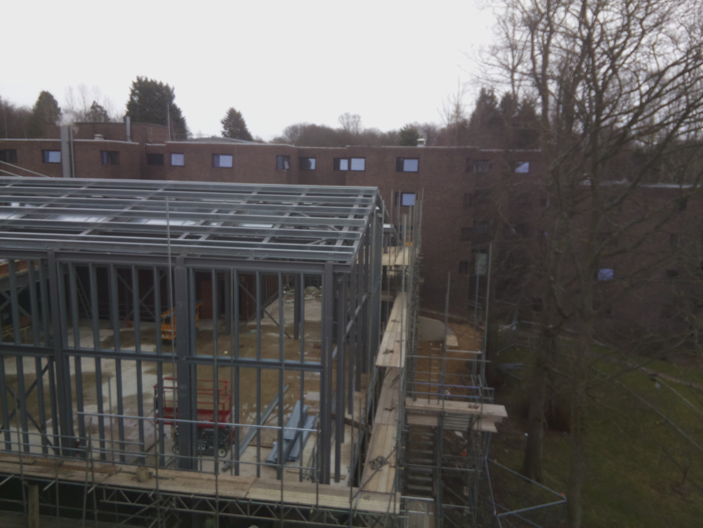

# Raspberry Pi Timelapse

## Introduction

For the 2017-2018 refurbishment project at Collingwood College, I made a timelapse camera to capture the progress of the project from the roof of an adjacent building. This was achieved using a Raspberry Pi (and Raspberry Pi camera) inside a gutted outdoor floodlight, powered using a PoE (Power over Ethernet) adapter.

## Usage

In camera.sh, change the `$DEST` variable to wherever you want to upload the photos via SCP (user@hostname)

Add the camera.sh to the crontab on the Raspberry Pi